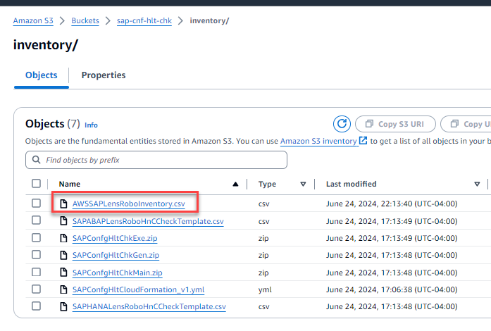

# SAP Infrastructure Health

## Table of Content

1. [Overview](https://github.com/aws-solutions-library-samples/guidance-for-automating-sap-configuration-health-checks-on-aws#overview)
    - [Cost](https://github.com/aws-solutions-library-samples/guidance-for-automating-sap-configuration-health-checks-on-aws#cost)
2. [Prerequisites](https://github.com/aws-solutions-library-samples/guidance-for-automating-sap-configuration-health-checks-on-aws#prerequisites)
3. [Deployment Steps](https://github.com/aws-solutions-library-samples/guidance-for-automating-sap-configuration-health-checks-on-aws#deployment-steps)
4. [Deployment Validation](https://github.com/aws-solutions-library-samples/guidance-for-automating-sap-configuration-health-checks-on-aws#deployment-validation)
5. [Running the Guidance](https://github.com/aws-solutions-library-samples/guidance-for-automating-sap-configuration-health-checks-on-aws#running-the-guidance)
6. [Next Steps](https://github.com/aws-solutions-library-samples/guidance-for-automating-sap-configuration-health-checks-on-aws#next-steps)
7. [Cleanup](https://github.com/aws-solutions-library-samples/guidance-for-automating-sap-configuration-health-checks-on-aws#cleanup)
8. [Notices](https://github.com/aws-solutions-library-samples/guidance-for-automating-sap-configuration-health-checks-on-aws#notices)
9. [Authors](https://github.com/aws-solutions-library-samples/guidance-for-automating-sap-configuration-health-checks-on-aws#authors)

## Overview
SAP Infrastructure Health solution helps to achieve the best performance, resiliency, and costs, companies running SAP on AWS need to benchmark their environment against AWS for SAP best practices. These best practices are documented in SAP Lens of AWS Well-Architected Framework aligned to six pillars - operational excellence, security, reliability, performance efficiency, cost optimization, and sustainability. SAP health-check solutions on AWS provide insights on customers' SAP configuration against AWS best practices.
<figure>


<figcaption aria-hidden="true">Figure 1: Ref Architecture </figcaption>
</figure>

### Cost
The following table provides a sample cost breakdown for deploying this Guidance with the default parameters in the US East (N. Virginia) Region for one month.


| AWS Service  | Dimensions | Cost (USD) |
| ------------ | ---------- | ---------- |
| Amazon DynamoDB | Table class (Standard), Average item size (all attributes) (10 KB), Data storage size (0.1 GB) | 0.16 |
| Amazon Simple Storage Service (S3) | S3 Standard storage (1 GB per month), PUT, COPY, POST, LIST requests to S3 Standard (100), GET, SELECT, and all other requests from S3 Standard (100), Data returned by S3 Select (0.1 GB per month), Data scanned by S3 Select (1 GB per month) | 0.03 |
| AWS Lambda      | Architecture (x86), Amount of ephemeral storage allocated (512 MB), Invoke Mode (Buffered), Number of requests (4 per month) | 0.00 |
| Amazon Simple Email Service (SES) | Email messages sent from EC2 (4 per month) | 0.01 |
| Amazon CloudWatch | Standard Logs: Data Ingested (0.2 GB) | 0.1 |
| Amazon QuickSight | Per User | $24 - $50 |


# Prerequisites
## Operating System
These deployment instructions work for SAP certified operating systems SUSE 12, SUSE 15, RHEL 7, RHEL 8 and RHEL 9. Please refer to [documentation](https://docs.aws.amazon.com/sap/latest/sap-hana/operating-system-configuration.html) for details.

## AWS Account requirements 

This deployment requires SAP workloads running in Amazon EC2 instance. 

- AWS Syststems Manager

# Deployment Steps

## Steps 1 - Pre-requisites and Scope of the solution

AWS Account with SAP Application workloads.
Please confirm the following services are available in the AWS account that you are planning to deploy this solution.
Create a new S3 bucket with the desired name.  

### AWS Services               

    Amazon S3                  
    AWS Lambda                 
    AWS Systems Manager        
    Amazon DynamoDB           
    AWS CloudFormation         
    AWS CloudTrail             
    Amazon CloudWatch          
    Amazon SES                 
    Amazon EventBridge         
    Amazon Athena (Optional)     
    Amazon Quick Sight (Optional)
    Amazon Q (Optional)
   
### AWS Architecture Patterns

    Single-AZ
    Multi-AZ
    Multiple Accounts

### SAP Workload Scope

    SAP NetWeaver Layer
      ASCS 
      ERS
      PAS
      AAS
    Databases
      SAP HANA


## Step  2 - Launch the CloudFormation Stack

Launch the AWS CloudFormation template included in this repository. The CloudFormation template creates the following resources within your AWS account: AWS Lambda, IAM role, Amazon DynamoDB Tables.

To deploy the solution guidance
1.	Download the SAPConfgHltCloudFormation.yml to your local machine.
2.	Open the CloudFormation >> Click Create stack >> With new resource ( standard )
3.	Prerequisite >> Choose an existing template
4.	Specify template >> Select Upload a template file
5.	Choose file >> select local SAPConfgHltCloudFormation.yml >> Next 
6.	Specify stack details >> Enter a stack name 
7.	ExistingS3BucketName >> Prove bucket name that was create in Step 1 >> Next >> Submit 


## Deployment Validation

Open CloudFormation console and verify the status of the template with the name starting with <Cfn-stackName>.
If deployment is successful, you should see AWS Lambda functions SAPConfgHltChkMain, SAPConfgHltChkGen, SAPConfgHltChkExe, and SAPConfgHltChkS3Notification, CopyFilesFunction1, Amazon DynamoDB table SAPConfgHltChk and SAPConfgHltChkTableMetaData.
Run the following CLI command to validate the deployment: aws cloudformation describe <Cfn-stackName>

## Running the Guidance

## Step  1 - Fill Up The Inventory File 

Download inventory file `AWSSAPLensRoboInventory.csv` from your S3 bucket and fill with your SAP inventory information.


<figure>

<figcaption aria-hidden="true">Figure 1: SAP Inventory File </figcaption>
</figure>


All fields are mandatory.

**sno:** Unique Number. 

**instance_id:** AWS Instance Id (i-xxxxxxxxx).

**sap_application:**  What SAP application is this instance part of?
Please use brief acronyms you identify them with, as it will be utilized on the Amazon QuickSight dashboard.
Example - Solman, BWonHANA, S4HANA, ECC6-EHP8, CRM, EWM, GRC, GTS, BW7.4.

**type_of_system:** What SAP landscape is this instance part of?
Keep the wording brief and basic, as it will be utilized as display text on the dashboard.
Example - Production, Development, Quality, Sandbox1, Sandbox2, Sandbox3.

**sap_component:** What SAP component does the Amazon EC2 instance run?
Please use the following naming convention based on which SAP component is executing within.
Example - HANA_DB_Primary, HANA_DB_Standby, HANA_DB_DR, HANA_DB

**sid:** System ID (SID) of SAP system. 

**sap_instance_no:** SAP System instance number. 

**sap_host_name:** Virtual hostname of the SAP component.

**ha_dr:** Flag to indicate if the system has HA and DR.  
Example: Possible combination of values.

|HA and DR option|		sap_component|
|:----------------|:----------------|
|No - HA or DR	  |		HANA_DB_Primary|
|HA only	        |HANA_DB_Primary or HANA_DB_Standby|
|DR only	        |HANA_DB_Primary or HANA_DB_DR|
|HA and DR	      |HANA_DB_Primary or HANA_DB_Standby or HANA_DB_DR|
			

**responsible_team:**  The email address of the responsible team for notification.

**Note:** At this time it only accepts one email. Emails that are part of inventory file should be verified via Amazon Simple Email Service. Please refer to [Amazon SES Documentation.](https://docs.aws.amazon.com/ses/latest/dg/creating-identities.html)

After you fill out the file  - `AWSSAPLensRoboInventory.csv` it looks like the following 

<figure>

<figcaption aria-hidden="true">Figure 2: Example SAP Inventory File </figcaption>
</figure>

## Step 2 - Upload the inventory file to Amazon S3 bucket 

After populating the `AWSSAPLensRoboInventory.csv` with all SAP Inventory details upload the file into the folder s3 bucket under folder “inventory”.

<figure>

<figcaption aria-hidden="true">Figure 3:  Upload SAP inventory file to Amazon S3://<buckname>/inventory</figcaption>
</figure>

After the file is uploaded, allow few minutes for each instance to populate the checks. 


### Step 3a - Periodic Execution of checks

Please enable SAPConfigHltSchedule rule under Amazon EventBridge Rules or create your own schedule. 

Enable and Edit/Configure the SAPConfigHltSchedule event rule for periodic execution of the chekcs.


<figure>

<figcaption aria-hidden="true">Figure 4:  Edit the Event schedule rule at your convenience.    
</figure>


In the invoke part of the schedule, choose the lambda function `SAPConfgHltChkMain` and construct json with the AWS instance ID for which you want to run the checks.


<figure>

<figcaption aria-hidden="true">Figure 5:  Event schedule  
</figure>


After the checks are completed successfully, the responsible team will get notified via email with high-priority drift information.


<figure>

<figcaption aria-hidden="true">Figure 4:  Drift email 
</figure>


### Step 3b - OnDemand execution of checks

Go to AWS Lambda → Locate Lambda function →  `SAPConfgHltChkMain`


<figure>

<figcaption aria-hidden="true">Figure 4:  SAPConfgHltChkMain AWS Lambda function
</figure>


Click Configure test event → 


<figure>

<figcaption aria-hidden="true">Figure 5:  Configure Test Event for SAPConfgHltChkMain AWS Lambda function
</figure>


**Event name:** SAPHealth_Check
**Event Json:** Based on the inventory file - Enter the AWS instance for which you wish the checks to be executed.

```
{
"sapinstanceID": [
"i-instanceid1",
"i-instanceid2"
]
}
```

After the instance is added to the JSON string in the test event, click on the AWS Lambda Test button. After the checks are completed successfully, email notifications with high-priority drift information are sent.


<figure>

<figcaption aria-hidden="true">Figure 6:  Drift email 
</figure>

### All the results of the checks are stored in the same Amazon S3 bucket.

<figure>

<figcaption aria-hidden="true">Figure 7:  Checks Results 
</figure>

## Next Steps
You can change the baseline configuration for compiance in column expected_string in Amazon DynamoDB table SAPConfgHltChk


## Cleanup

To Cleanup

- Open the AWS CloudFormation console at https://console.aws.amazon.com/cloudformation.
- On the Stacks page in the CloudFormation console, choose the stack name that you created in step 2. 
- In the stack details pane, choose Delete.
- Select Delete stack when prompted.For more deatils check - https://docs.aws.amazon.com/AWSCloudFormation/latest/UserGuide/cfn-console-delete-stack.html
- Finally, delete the contents of an S3 bucket created to implement the solution.

## Notices
Customers are responsible for making their own independent assessment of the information in this Guidance. This Guidance: (a) is for informational purposes only, (b) represents AWS current product offerings and practices, which are subject to change without notice, and (c) does not create any commitments or assurances from AWS and its affiliates, suppliers or licensors. AWS products or services are provided “as is” without warranties, representations, or conditions of any kind, whether express or implied. AWS responsibilities and liabilities to its customers are controlled by AWS agreements, and this Guidance is not part of, nor does it modify, any agreement between AWS and its customers.


## Authors
Parishudh Marupurolu, Bharat Ramaka 
